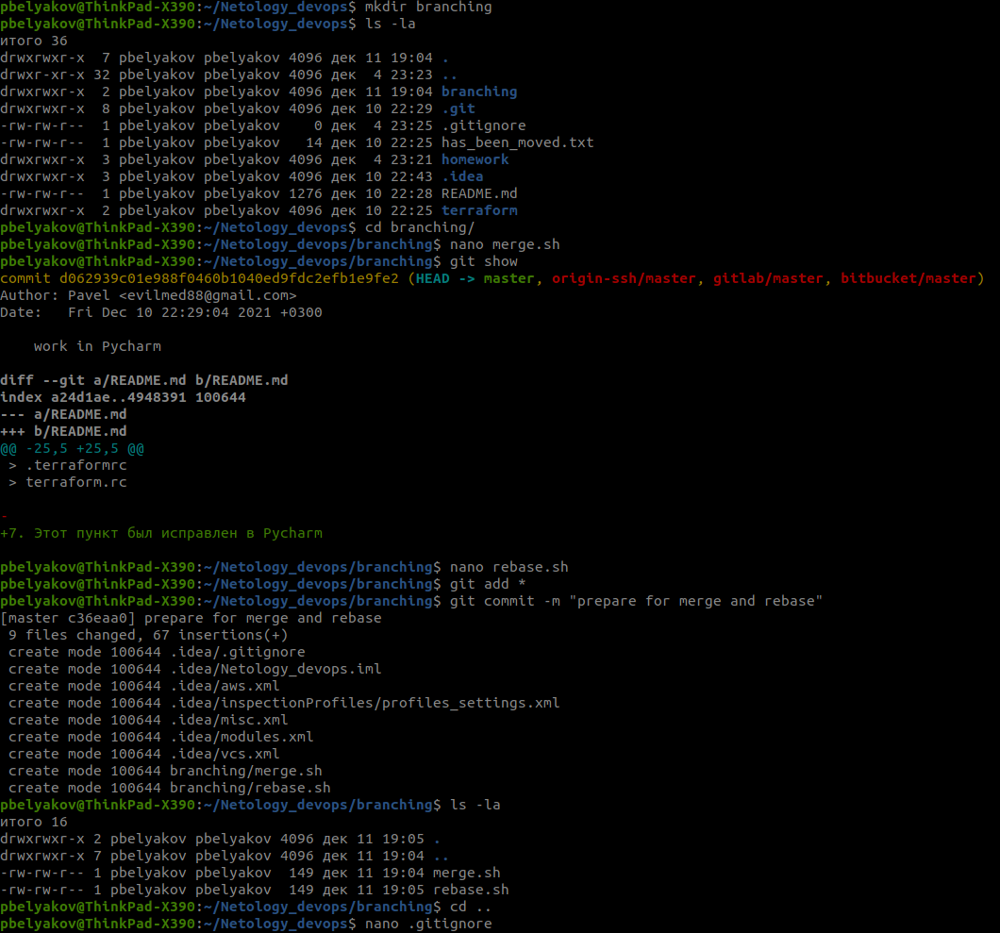
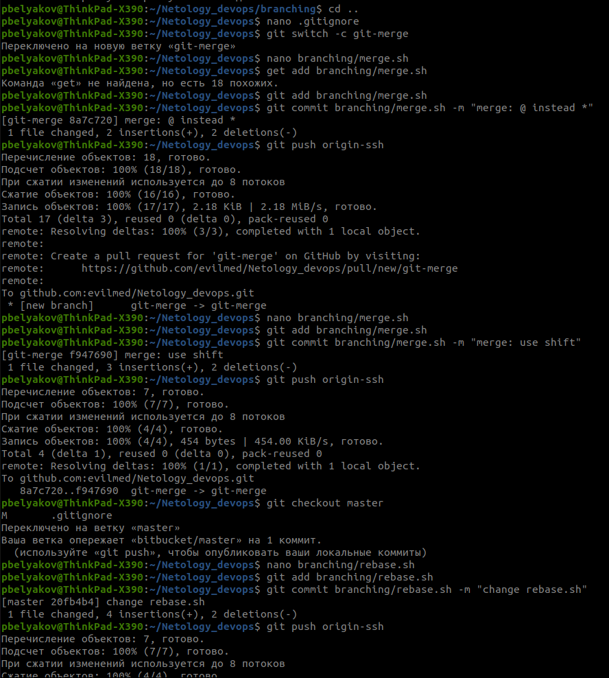
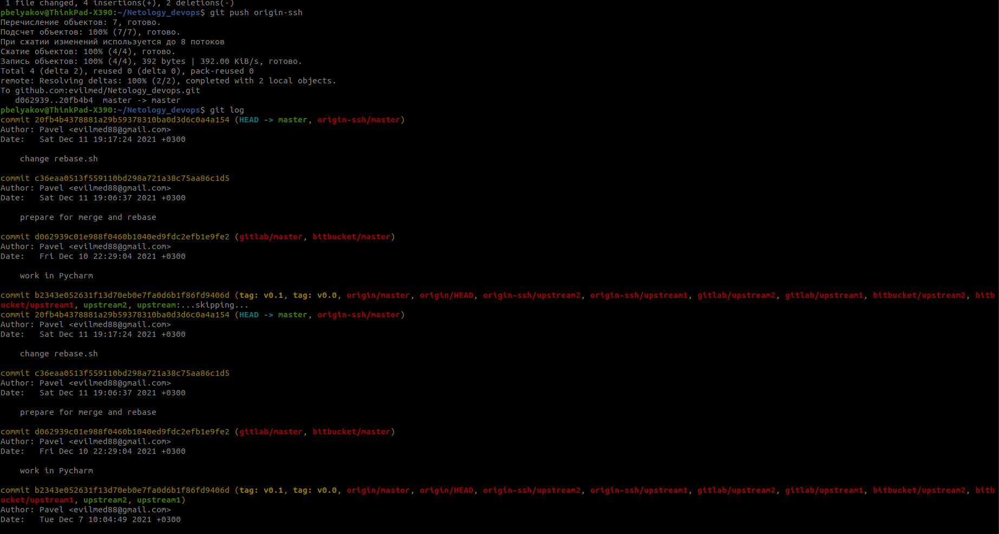
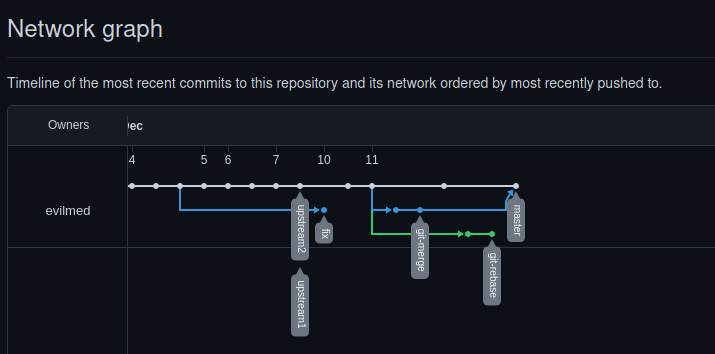
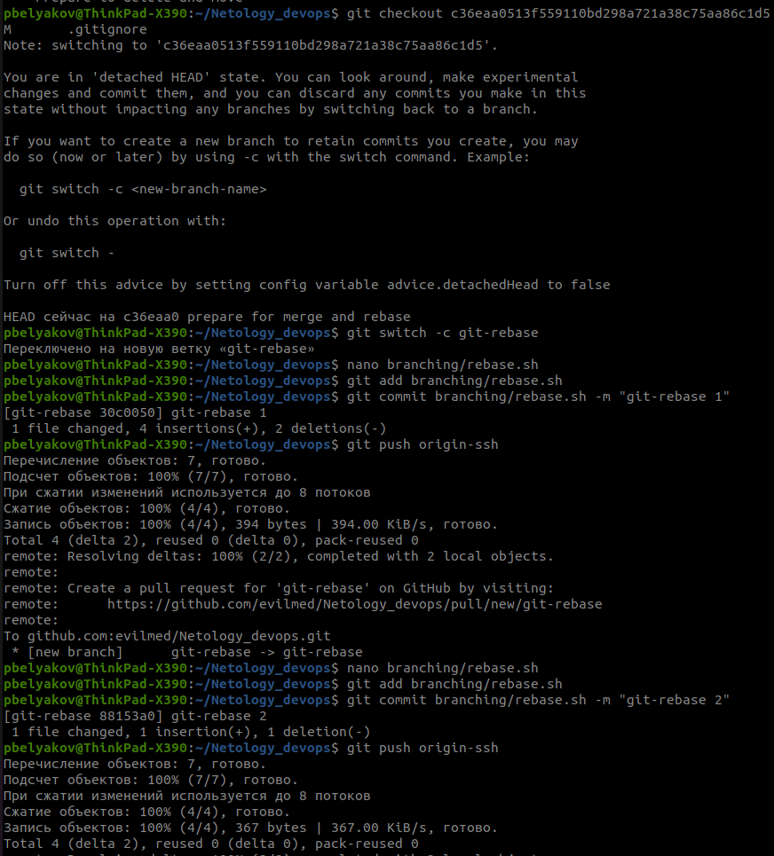
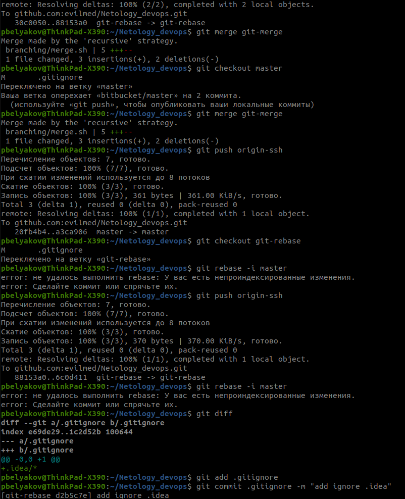
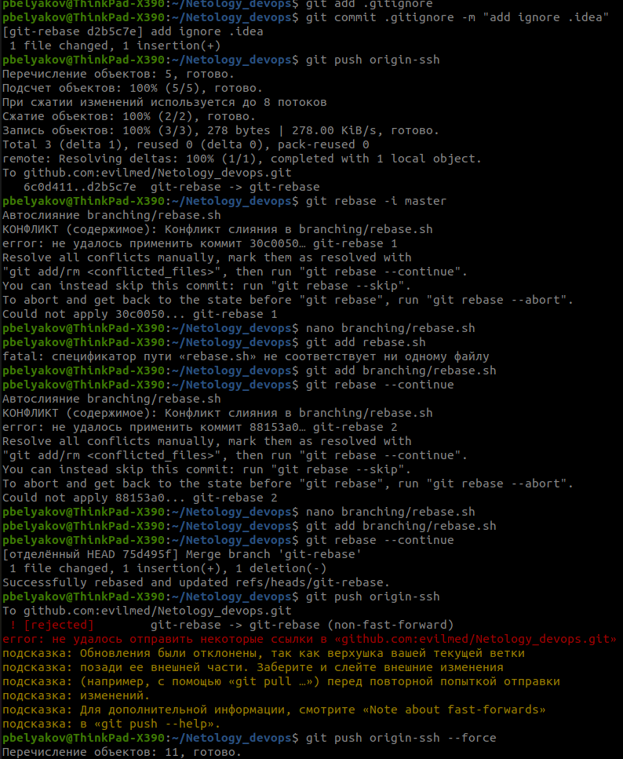
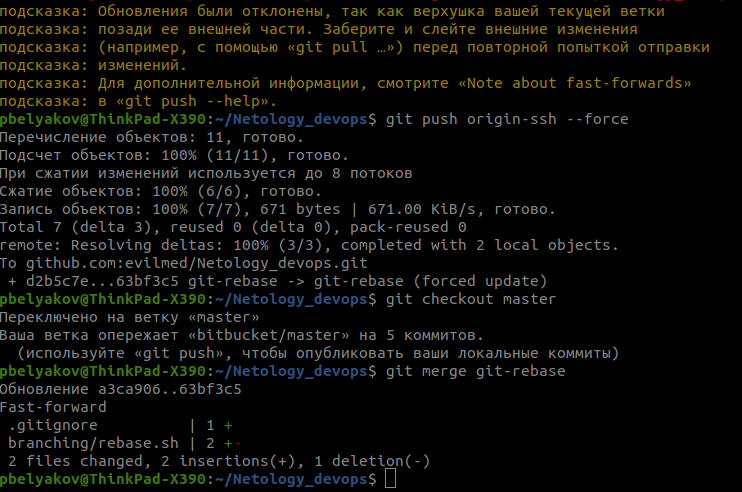
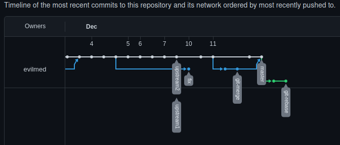

# Тут будут выполнены все ДЗ по курсу devops-15

## Задание № 1

1. Будут игнорироваться все файлы в папке .terraform во всех подпапках проекта 
 > **/.terraform/*

2. Будут игнорироваться все файлы, которые в конце имеют окончание ".tfstate" и все файлы в имени которых есть буквосочетание ".tfstate." 
*.tfstate
 > *.tfstate.*

3. Будет игнорироваться файл с названием "crash.log"
 > crash.log

4. Будут игнорироваться все файлы, которые в конце имеют окончание ".tfvars"
 > *.tfvars

5. Будут игнорироваться все файлы, которые в конце имеют окончание  "_override.tf" и "_override.tf.json", а также файлы с названием override.tf и override.tf.json
 > override.tf
 > override.tf.json
 > *_override.tf
 > *_override.tf.json

6. Будут игнорироваться файлы c названием ".terraformrc" и "terraform.rc"
> .terraformrc
> terraform.rc

7. Этот пункт был исправлен в Pycharm

## Задание № 1 от лекции "Ветвления в GIT"

        

