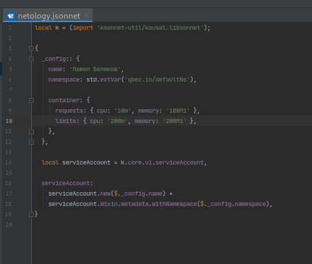
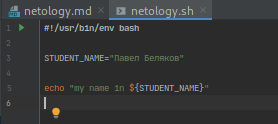
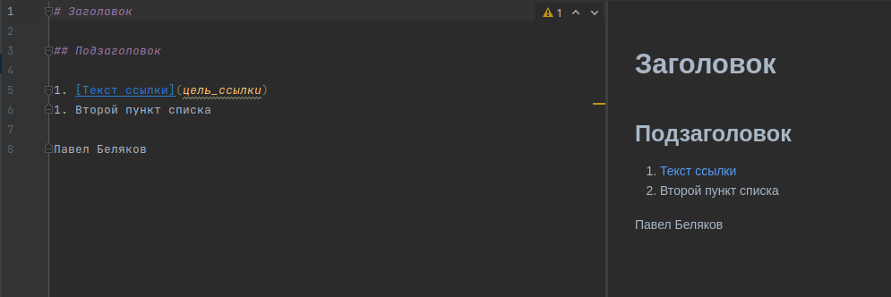
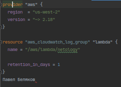
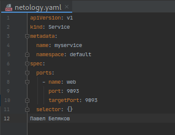

#Домашнее задание по курсу DEVOPS-15

## ДЗ № 1

​

​

​

​

## ДЗ № 2

Процесс состоит из слудующих частей (Work Flow):

1. Заказчик общается с менеджером и описывает новый функционал ПО.
2. Менеджер анализирует полученную информацию и пишет эпик программистам, декомпозируя задачи.
3. Разработчик берет задачу в работу и программирует необходимый функционал в виде кода, а также пишет автотесты для нового функционала.
4. Тимлид делает ревью кода разработчика и в случае корректного кода разрешает разработчику выложить код в тестовую среду.
5. Devops автоматизирует весь порядок действий от 1 до последнего, предусмотрев шаги возврата на предыдущие пункты в случае неудачного прохождения.
5. В тестовой среде работают тестировщики, они в свою очередь выявляют баги нового фунцкионала произведя различные виды тестирования.
6. В случае одобрения тестировщиком нового функционала, он подтверждает готовность нового функционала для работы в продакшене.
7. Devops инженер проангализировав все предыдущие пути загружает новый функционал на стенд с Прогграмным обеспечением.
8. Менеджер демонстритует новый функционал заказчику и в случае положительного показа закрывает поставленные задачи.